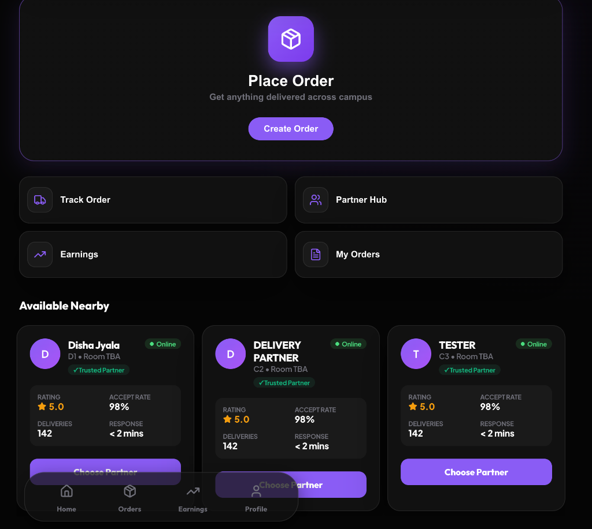
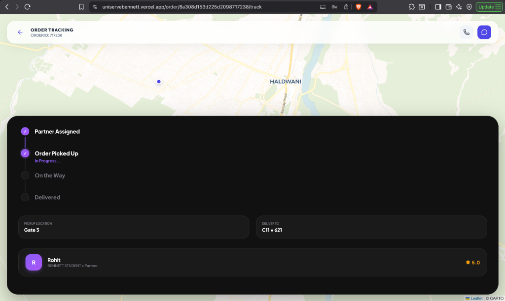
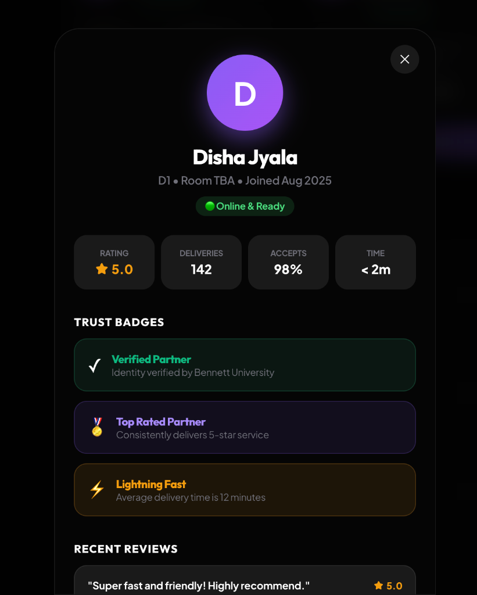

# UniServe: Peer-to-Peer Campus Delivery Engine

[](https://reactjs.org/)
[](https://nodejs.org/)
[](https://www.mongodb.com/)
[](https://socket.io/)
[](https://razorpay.com/)

UniServe is a full-stack, real-time campus delivery platform that enables students to request food, parcels, and essentials while allowing fellow students to earn through hyper-local deliveries within the university ecosystem.

## Product Interface

### Central Dashboard


### Real-Time Order Tracking


### Partner Network & Trust System


## Architecture Overview (For Recruiters)

UniServe is designed as a scalable, real-time application using a modern MERN stack. The architecture emphasizes low-latency communication, secure transactions, and a highly polished, responsive user interface.

### High-Level System Design
* **Client Layer:** React single-page application built with Vite, utilizing context API for global state management. Styled with a custom CSS design system optimized for a premium SaaS aesthetic.
* **API Layer:** Node.js and Express.js RESTful API handling authentication, order creation, profile management, and payment processing.
* **Real-Time Engine:** Socket.io server enabling instant state synchronization. It uses a dual-room architecture (`user_{id}` and `order_{id}`) to push targeted updates for order statuses, chat messages, and live geolocation coordinates.
* **Data Layer:** MongoDB Atlas with optimized indexing for geospatial queries and complex aggregations between Users, Orders, and Reviews.

### Technical Highlights
* **WebSockets for State Sync:** Overcomes HTTP polling limitations by establishing persistent duplex connections. This reduces server overhead and ensures instant UI updates when a partner accepts an order or moves on the map.
* **Geospatial Tracking:** Integrates Leaflet.js on the client side with custom coordinate broadcasting on the backend to render live partner movements in real time.
* **Hybrid Payment Flow:** Secure integration with Razorpay for online transactions alongside cash-on-delivery tracking workflows.
* **Intelligent Matching Engine:** Backend algorithm that filters and surfaces the most reliable delivery partners based on proximity, historical ratings, and acceptance rates.
* **Stateless Authentication:** JWT token-based security locked strictly to university domain email addresses.

## Key Features

* University-domain authentication
* Smart delivery request management
* Partner ranking based on ratings, proximity, and completion rate
* Real-time chat with typing indicators
* Live delivery tracking using Geolocation API
* Secure payments with Razorpay integration
* Partner earnings and performance dashboard
* Instant notifications powered by WebSockets

## Tech Stack

* **Frontend:** React, Vite, Custom Design System
* **Backend:** Node.js, Express.js, Socket.io
* **Database:** MongoDB Atlas
* **Payments:** Razorpay
* **Maps:** Leaflet.js

## Getting Started

```bash
git clone <repo-url>
cd project

# Backend
cd backend
npm install
npm start

# Frontend
cd frontend
npm install
npm run dev
```

## Developer Notes

UniServe was built to solve a real logistics problem within university campuses. This project showcases practical experience in full-stack development, distributed real-time systems, payment gateway integrations, mapping utilities, and scalable software design.
